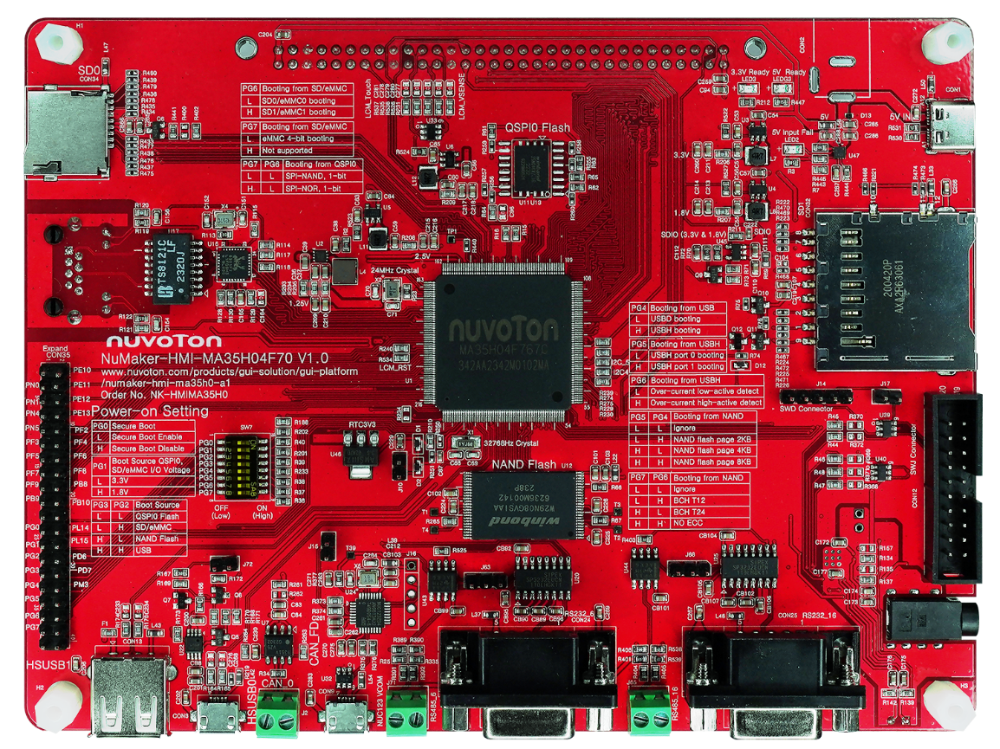
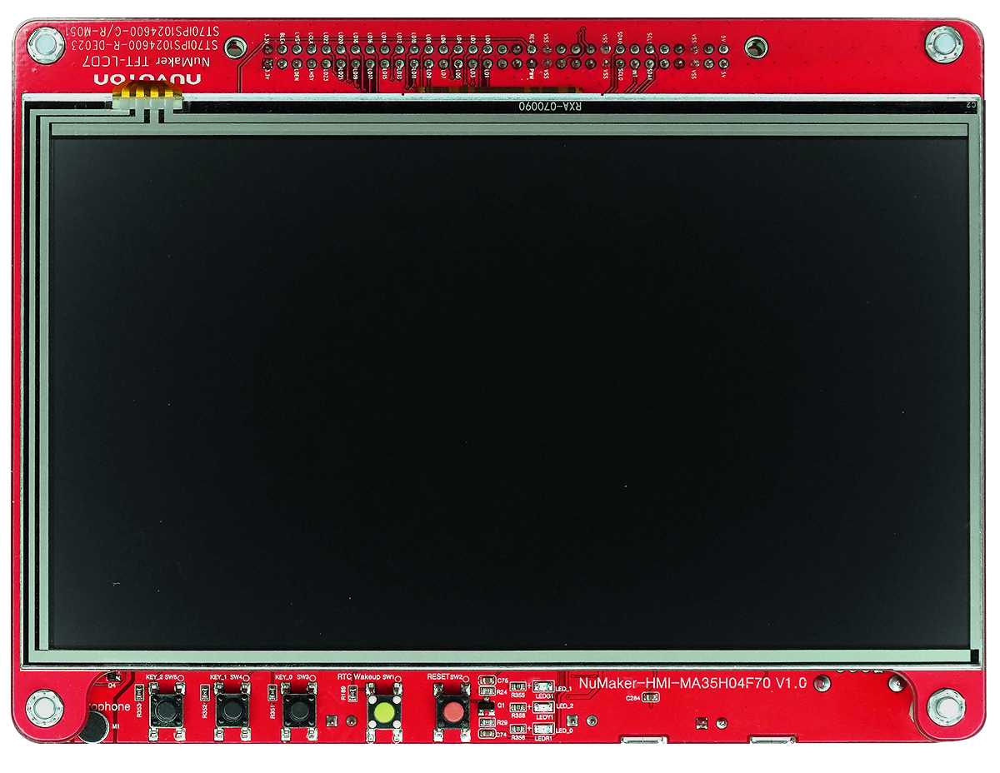

# **NuMaker-HMI-MA35H0**

## **Introduction**

The NuMaker-HMI-MA35H0 is an evaluation board for Nuvoton NuMicro MA35H0 series microprocessors, and consists of two parts: a NuMaker- HMI-MA35H04F70 board and a NuMaker-TFT-LCD7 board. The NuMaker-HMI-MA35H0 board integrates core components to simplify the system design, based on MA35H04F767C (LQFP216 package, and stacking a 128 MB DDR), discrete power supply power solution, and one megabit Ethernet PHY. The NuMaker-HMI-MA35H0-A1 has rich peripherals such as 1 set of megabit Ethernet, USB2.0 high-speed host and device, 1 set of SD2.0 in Micro SD slot, 1 set of SD3.0 in SD slot, 1 set of CAN FD, SPI, I2C, UART, and 2 sets of RS-485/RS-232 serial communication ports for users to facilitate the evaluation in HMI and industrial control, home appliances, 2-wheel cluster, medical device, new energy applications, ML (Machine Learning) or your creative applications. The NuMicro MA35H0 series is a multi-core microprocessor targeted to various HMI applications in the medium resolution. It is based on dual 64/32-bit Arm Cortex-A35 cores, the high-performance cores run up to 650 MHz and include 32/32 KB I/D L1 cache for each core, and a 512 KB shared L2 cache. The MA35H0 series has a built-in 128 KB IBR (Internal Boot ROM) and supports secure booting from four modes, USB, SD/eMMC, NAND, and SPI Flash (SPI NOR/SPI NAND). In order to provide easy system design and manufacture, the MA35H0 series also offers LQFP package stacked with a DDR SDRAM and the size up to 128 MB.

<p align="center">

</p>

|NuMaker-HMI-MA35H0|NuMaker TFT-LCD7|
|--|--|
|<p align="center"></p>|<p align="center"></p>|

## **Supported compiler**

Support GCC compiler. More information of these compiler version as following:

| Compiler | Tested version |
| -- | -- |
| GCC | Arm Embedded Toolchain 10.3-2021.10 (Env 1.3.5 embedded version)|

## **Build RT-Thread**

You can build rt-thread.bin for NuMaker-HMI-MA35H0 board. Steps as following.

```bash
# cd rt-thread/bsp/nuvoton/numaker-hmi-ma35h0
# menuconfig --generate
# scons -c
# pkgs --update
# scons -j 16

<Path-to-rt-thread>\bsp\nuvoton\numaker-hmi-ma35h0\rtthread.bin
```

## **Program firmware using NuWriter**

To switch SW7 dip-switch on NuMaker-HMI-MA35H0 base board to do corresponding  actions as below.

**Power-on Setting**
L: OFF dip-switch
H: ON dip-switch

| Memory Storage | **Burn to** settings | **Boot from** settings |
|--|--|--|
| **DDR** | <ul><li>Switch 1(PG0) to ON.</li><li>Switch 3(PG2) to ON.</li><li>Switch 4(PG3) to ON.</li><li>Switch Others to OFF.</li></ul> |  |
| **SD0**<br>(Select SD0/1 device and 4-bit mode) | <ul><li>Switch 1(PG0) to ON.</li><li>Switch 3(PG2) to ON.</li><li>Switch 4(PG3) to ON.</li><li>Switch 8(PG7) to ON.</li><li>Switch Others to OFF.</li></ul> | <ul><li>Switch 1(PG0) to ON.</li><li>Switch 3(PG2) to ON.</li><li>Switch Others to OFF.</li></ul> |
| **SD1**<br>(Select SD0/1 device and 4-bit mode) | <ul><li>Switch 1(PG0) to ON.</li><li>Switch 3(PG2) to ON.</li><li>Switch 4(PG3) to ON.</li><li>Switch 7(PG6) to ON.</li><li>Switch 8(PG7) to ON.</li><li>Switch Others to OFF.</li></ul> | <ul><li>Switch 1(PG0) to ON.</li><li>Switch 3(PG2) to ON.</li><li>Switch 7(PG6) to ON.</li><li>Switch Others to OFF.</li></ul> |
| **Raw NAND**<br>(Select Ignore BCH and Page setting) | <ul><li>Switch 1(PG0) to ON.</li><li>Switch 3(PG2) to ON.</li><li>Switch 4(PG3) to ON.</li><li>Switch Others to OFF.</li></ul> | <ul><li>Switch 1(PG0) to ON.</li><li>Switch 4(PG3) to ON.</li><li>Switch Others to OFF.</li></ul> |
| **Serial NAND**<br>(Select 4-bit mode) | <ul><li>Switch 1(PG0) to ON.</li><li>Switch 3(PG2) to ON.</li><li>Switch 4(PG3) to ON.</li><li>Switch 7(PG6) to ON.</li><li>Switch Others to OFF.</li></ul> | <ul><li>Switch 1(PG0) to ON.</li><li>Switch 7(PG6) to ON.</li><li>Switch Others to OFF.</li></ul> |
| **Serial NOR**<br>(Select 4-bit mode) | <ul><li>Switch 1(PG0) to ON.</li><li>Switch 3(PG2) to ON.</li><li>Switch 4(PG3) to ON.</li><li>Switch 7(PG6) to ON.</li><li>Switch 8(PG7) to ON.</li><li>Switch Others to OFF.</li></ul> | <ul><li>Switch 1(PG0) to ON.</li><li>Switch 7(PG6) to ON.</li><li>Switch 8(PG7) to ON.</li><li>Switch Others to OFF.</li></ul> |

### **Download to DDR and Run**

You can run windows batch script to download rtthread.bin into memory, then run it. The path of batch script as below.

```bash
<path-to-rtthread>\bsp\nuvoton\numaker-hmi-ma35h0\nuwriter_scripts\nuwriter_ddr_download_and_run.bat
```

### **Burn to SD0/1**

You can run windows batch script to download rtthread.bin into SD card, then run it. The path of batch script as below.

```bash
<path-to-rtthread>\bsp\nuvoton\numaker-hmi-ma35h0\nuwriter_scripts\nuwriter_program_sd.bat
```

### **Burn to Serial NAND**

You can run windows batch script to download rtthread.bin into SPI-NAND flash, then run it. The path of batch script as below.

```bash
<path-to-rtthread>\bsp\nuvoton\numaker-hmi-ma35h0\nuwriter_scripts\nuwriter_program_spinand.bat
```

### **Burn to Raw NAND**

You can run windows batch script to download rtthread.bin into Raw NAND flash, then run it. The path of batch script as below.

```bash
<path-to-rtthread>\bsp\nuvoton\numaker-hmi-ma35h0\nuwriter_scripts\nuwriter_program_rawnand.bat
```

## **Test**

You can use Tera Term terminate emulator (or other software) to type commands of RTT. All parameters of serial communication are shown in below image. Here, you can find out the corresponding port number of Nuvoton Virtual Com Port in window device manager.

## **Purchase**

* [Nuvoton Direct](https://direct.nuvoton.com/en/numaker-hmi-ma35h0)
